# BitPath: BitNet1.58b Distillation of Gigapath

**Goal**: Train a lightweight ternary convolutional network (BitNet1.58b-style)
that predicts bipolar features `{−1, 0, +1}` directly from raw pathology tiles,
bypassing the heavyweight Gigapath backbone at inference time.

---

## 1  High-Level Pipeline

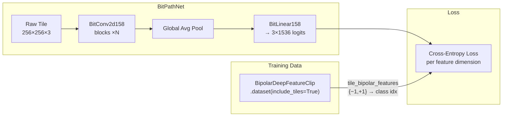

Each training sample from `BipolarDeepFeatureClip.dataset(include_tiles=True)`
contains:

| Field | Type | Shape | Description |
|-------|------|-------|-------------|
| `tile` | `uint8` ndarray | `(256, 256, 3)` | Raw RGB tile from the slide |
| `tile_bipolar_features` | `int8` ndarray | `(1536,)` | Bipolar features: values in `{−1, +1}` |
| `tile_index` | `int32` | scalar | Tile index within the bag |
| `bag_index` | `int32` | scalar | Which bag this tile belongs to |

The network outputs `(B, 3, 1536)` logits — **3 classes per feature dimension** —
and the loss is per-dimension cross-entropy against the target class index
derived from the bipolar value.

### Target Encoding

```
Bipolar value    Class index
─────────────    ───────────
     −1      →       0
      0      →       1       (bag-level only; tiles are always ±1)
     +1      →       2
```

At tile level the targets are always `{−1, +1}` → classes `{0, 2}`.
The 3-class setup future-proofs for bag-level supervision if desired.

---

## 2  BitNet 1.58b: Ternary Weight Quantization

BitNet 1.58b ([Ma et al., 2024](https://arxiv.org/abs/2402.17764)) constrains
every weight to `{−1, 0, +1}`, reducing multiply-accumulate operations to
additions and subtractions. The name "1.58 bits" comes from
`log₂(3) ≈ 1.585` — each weight carries ~1.58 bits of information.

### 2.1  Absmean Quantization

Given a real-valued weight tensor `W`, the ternary approximation `W̃` is:

```
α = mean(|W|)                          # per-tensor scale factor
W̃ = round(clip(W / α, −1, +1))        # quantize to {−1, 0, +1}
```

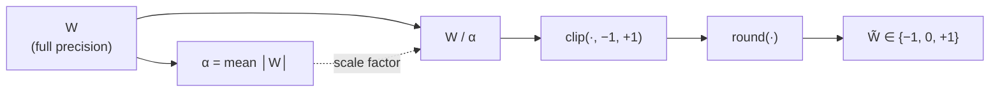

**Why absmean?**  It's parameter-free, cheap to compute, and adapts to the
weight distribution automatically.  Weights near zero get snapped to `0`
(pruned), while large-magnitude weights keep their sign.

### 2.2  Straight-Through Estimator (STE)

Quantization (`round`, `clip`) is non-differentiable.  During backpropagation
we use the **Straight-Through Estimator**: pretend the quantization function
is the identity for gradient purposes.

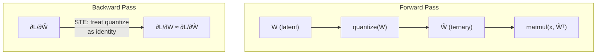

In PyTorch this is implemented as:

```python
# Forward: use quantized weights for computation
# Backward: gradients flow through to the latent (full-precision) weights
W_quant = quantize(W)
W_ste = W + (W_quant - W).detach()   # forward = W_quant, backward ∂/∂W = I
output = F.linear(x, W_ste, bias)
```

The optimizer updates `W` (full precision).  At the start of each forward pass,
`W` is re-quantized on the fly.  The latent weights slowly drift under gradient
pressure, and the quantized snapshot changes discretely.

### 2.3  Activation Quantization (Optional)

BitNet 1.58b also quantizes activations to 8-bit before each linear/conv layer
using **absmax** quantization:

```
γ = max(|x|)
Q_b = 2^(b−1)                        # e.g. 128 for 8-bit
x̃ = clip(round(x × Q_b / γ), −Q_b + 1, Q_b − 1)
```

This is applied *after* layer normalisation (RMSNorm in the original paper),
so the activation distribution is well-behaved.

---

## 3  BitConv2d158 — Ternary Convolution Layer

A drop-in replacement for `nn.Conv2d` with BitNet 1.58b quantization.

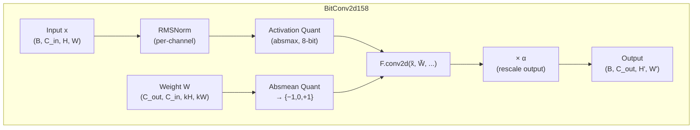

### Forward pass pseudocode

```python
def forward(self, x):
    # 1. Normalise activations
    x = self.rms_norm(x)

    # 2. Quantize activations (absmax, 8-bit)
    gamma = x.abs().max()
    Qb = 2 ** (self.activation_bits - 1)
    x_quant = (x * Qb / gamma).round().clamp(-Qb + 1, Qb - 1)

    # 3. Quantize weights (absmean → ternary)
    alpha = self.weight.abs().mean()
    w_scaled = self.weight / (alpha + eps)
    w_quant = w_scaled.clamp(-1, 1).round()
    w_ste = self.weight + (w_quant * alpha - self.weight).detach()

    # 4. Convolution with quantized operands
    #    (in practice x_quant × w_ste, so matmuls become adds/subs)
    return F.conv2d(x_quant, w_ste, self.bias,
                    self.stride, self.padding, self.dilation, self.groups)
```

### Key properties

| Property | Value |
|----------|-------|
| Weight values | `{−1, 0, +1} × α` |
| Activation precision | 8-bit symmetric |
| Normalization | RMSNorm (per-channel, before quant) |
| Gradient flow | STE through both weight and activation quantization |
| Memory savings | ~16× vs FP32 weights (1.58 bits per weight) |
| Compute savings | Multiply → add/subtract (ternary matmul) |

---

## 4  BitPathNet — Full Network Architecture

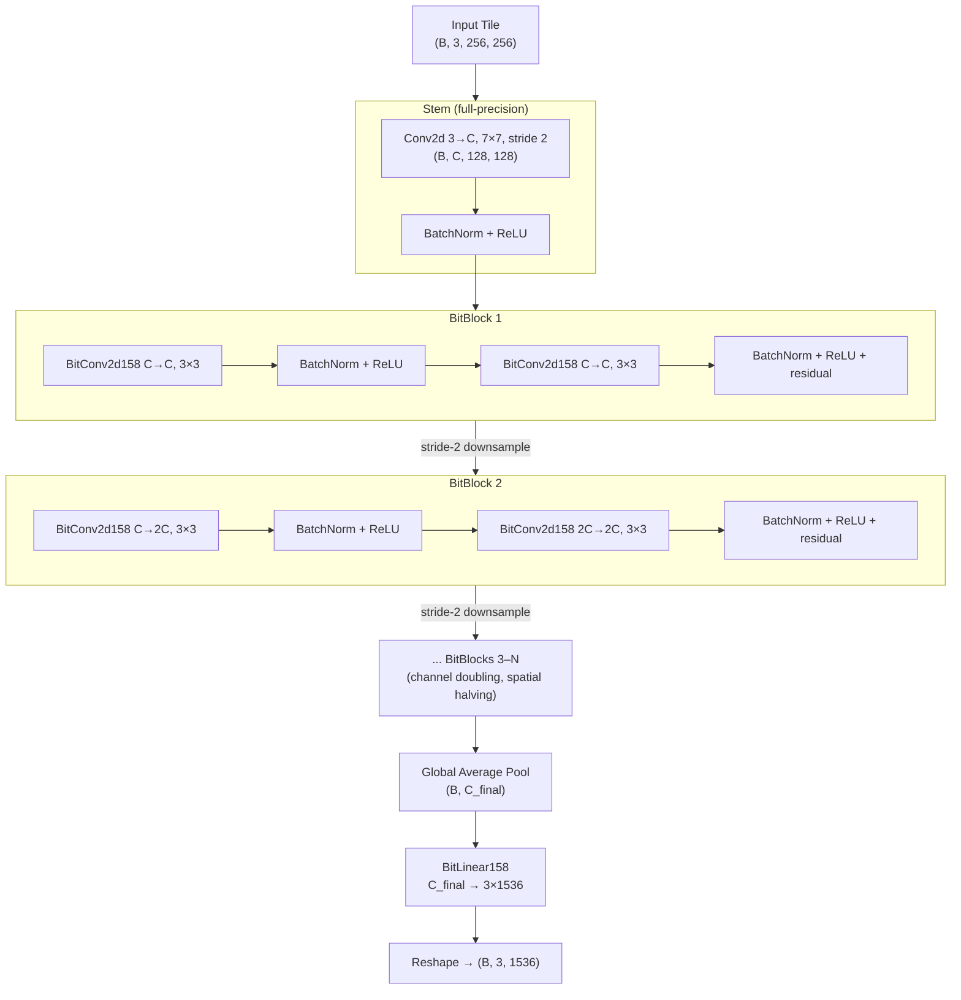

### Design choices

- **Stem is full-precision**: The first conv uses standard `nn.Conv2d` because
  the input (RGB pixels) has very low entropy and quantizing 3-channel inputs
  to ternary weights loses too much information.

- **Residual connections**: Each BitBlock uses a skip connection around the two
  `BitConv2d158` layers.  When channel dimensions change, a 1×1 projection
  adapts the shortcut.

- **No pooling layers**: Spatial reduction is done via stride-2 convolutions
  (integrated into the first conv of each block), preserving information
  better than max/avg pooling.

- **Global average pool → linear head**: After the conv blocks, spatial
  dimensions are collapsed and a single `BitLinear158` layer produces the
  3×1536 output logits.

### Default configuration

| Parameter | Default | Description |
|-----------|---------|-------------|
| `n_blocks` | 6 | Number of residual BitBlocks |
| `hidden_channels` | 128 | Base channel width (doubles each block) |
| `output_dim` | 1536 | Gigapath feature dimension |
| `n_classes` | 3 | `{−1, 0, +1}` |
| `activation_bits` | 8 | Activation quantization precision |
| `stem_channels` | `hidden_channels` | Stem output channels |

### Parameter count estimate

With `hidden_channels=128` and `n_blocks=6`:
- Stem: ~18K params
- BitBlocks: channels go 128→128→256→256→512→512→... ≈ 4–8M params
- Head: `C_final × 3×1536` ≈ 4.7M (if C_final=1024)
- **Total**: ~10–15M parameters (all ternary except stem)

---

## 5  Training Process

```mermaid
sequenceDiagram
    participant DL as DataLoader
    participant Net as BitPathNet
    participant Loss as CrossEntropy
    participant Opt as Adam

    loop Each batch
        DL->>Net: tiles (B, 3, 256, 256)
        Note over Net: Forward pass with<br/>STE-quantized weights
        Net->>Loss: logits (B, 3, 1536)
        DL->>Loss: bipolar targets (B, 1536)<br/>mapped to class indices
        Loss->>Opt: dL/dW (via STE)
        Opt->>Net: Update latent weights W<br/>(full precision)
    end
```

### Loss function

Per-dimension cross-entropy, averaged over all 1536 feature dimensions:

```python
# logits: (B, 3, 1536)  — 3-class logits per feature dim
# targets: (B, 1536)    — class indices in {0, 1, 2}
loss = F.cross_entropy(
    logits.permute(0, 2, 1).reshape(-1, 3),  # (B*1536, 3)
    targets.reshape(-1),                      # (B*1536,)
)
```

The target mapping is:
- `tile_bipolar_features == -1` → class `0`
- `tile_bipolar_features ==  0` → class `1`
- `tile_bipolar_features == +1` → class `2`

### Optimizer & scheduler

- **Optimizer**: AdamW with `weight_decay` (default 0.01)
- **LR scheduler**: Cosine annealing with warmup
- **Gradient clipping**: By norm (default 1.0)
- **Precision**: `bf16-mixed` for speed on A100/H100

### Multi-GPU training

Lightning `Trainer` with `strategy='ddp'` when `n_devices > 1`.
The `BitPathStill` constructor accepts `n_devices` or `devices` list.

---

## 6  Datablock Hierarchy

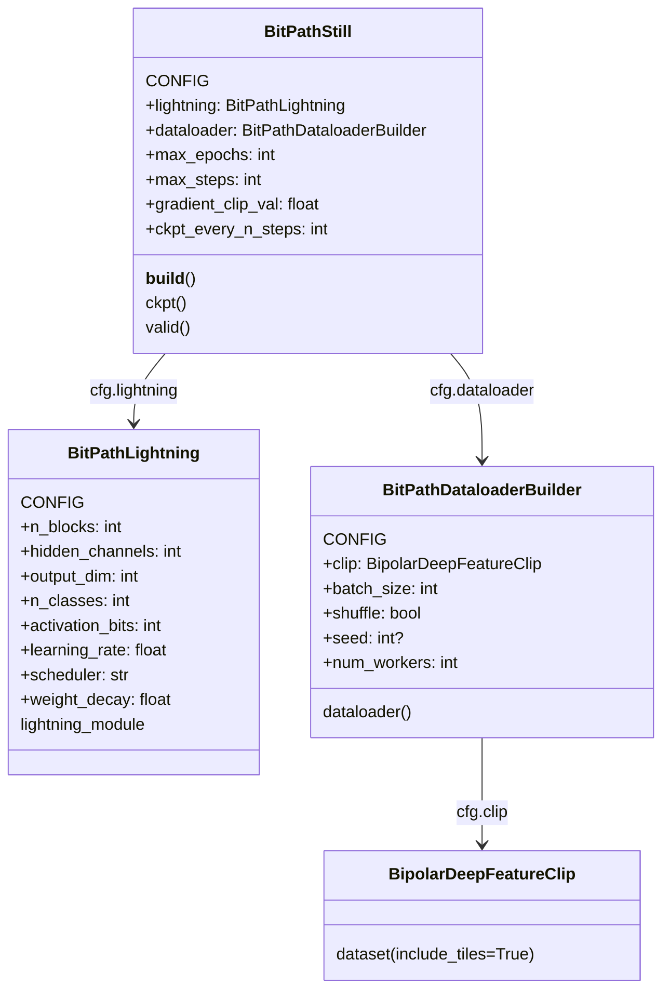

### CONFIG boundaries

Only parameters that affect the **output** of training go in CONFIG
(so the Datablock hash changes when results would change):

| Datablock | CONFIG params | Non-CONFIG params |
|-----------|--------------|-------------------|
| `BitPathDataloaderBuilder` | `clip`, `batch_size`, `shuffle`, `seed`, `num_workers` | — |
| `BitPathLightning` | `n_blocks`, `hidden_channels`, `output_dim`, `n_classes`, `activation_bits`, `learning_rate`, `scheduler`, `weight_decay` | — |
| `BitPathStill` | `lightning`, `dataloader`, `max_epochs`, `max_steps`, `gradient_clip_val`, `ckpt_every_n_steps`, `precision` | `n_devices`, `devices`, `logsroot` |

---

## 7  Pipeline: `bitpath_still()`

```python
from autopath.deep.pipelines import bitpath_still

still = bitpath_still(
    'GIGAPATH_DEEP_CPTAC_602020_TRAIN',
    cfg_layer='output',
    cfg_cls_token_only=True,
    cfg_shard_size=64,
    cfg_batch_size=64,
    cfg_n_blocks=6,
    cfg_hidden_channels=128,
    cfg_learning_rate=1e-3,
    max_steps=10000,
    n_devices=4,
)
still.build_tree()
```

The pipeline:
1. Constructs a `BipolarDeepFeatureClip` (via `bipolar_deep_feature_clip()`)
2. Wraps it in a `BitPathDataloaderBuilder`
3. Creates a `BitPathLightning` with architecture params
4. Assembles `BitPathStill` with the lightning + dataloader + training params
5. Returns the still, ready for `.build_tree()`

---

## 8  Inference (Post-Training)

After training, the model's ternary weights can be extracted and stored
compactly.  Inference on a new tile:

```python
still = bitpath_still('GIGAPATH_DEEP_CPTAC_602020_TRAIN', ...)
model = still.cfg.lightning.lightning_module
model.eval()

tile = torch.randn(1, 3, 256, 256)  # preprocessed tile
logits = model(tile)                  # (1, 3, 1536)
predicted_bipolar = logits.argmax(dim=1) - 1  # class {0,1,2} → {-1,0,+1}
```

The predicted bipolar features should approximate the Gigapath-derived
bipolar features but computed ~100–1000× faster (no ViT backbone, only
ternary convolutions).

---

## Results

### June 12, 2026

#### AffineLogisticProbe on CPTAC 60/20/20

All probes use `cfg_layer='output'`, `cfg_cls_token_only=True`, `cfg_shard_size=64` on the CPTAC 60/20/20 split.  Evaluation is on the 20% test fold (n=444 slides, 10 cancer types).

**Asphericity** is defined as the mean `|intercept / coefficient|` ratio across feature dimensions in the per-class affine logistic classifier.  A value near 0 means the classifier's decision boundary passes close to the origin in feature space (the class cluster is approximately origin-centred); larger values indicate the boundary is offset — the class occupies a region far from zero in that feature.

---

##### Gigapath real-valued features (`gigapath_deep_feature_affine_logistic_probe`)

| Normalization | Accuracy | Macro F1 | Weighted F1 | Mean Asphericity |
|---|---|---|---|---|
| none | **0.97** | 0.93 | 0.97 | 0.020 |
| `corner-l1` | **0.97** | **0.96** | **0.97** | **0.015** |
| `l2` | 0.90 | 0.88 | 0.89 | 0.087 |
| `corner-linfty` | 0.56 | 0.36 | 0.53 | 0.140 |

<details>
<summary>Per-class — gigapath, no normalization (accuracy 0.97)</summary>

BRCA–OV rows not captured (output truncated at collection time).
Known: PDA P=0.98/R=0.98/F1=0.98 (n=49), UCEC P=1.00/R=0.97/F1=0.99 (n=68). Macro F1=0.93, weighted F1=0.97.

Asphericity: BRCA=0.021, CCRCC=0.018, COAD=0.028, GBM=0.025, HNSCC=0.026, LSCC=0.019, LUAD=0.012, OV=0.021, PDA=0.005, UCEC=0.022.
</details>

<details>
<summary>Per-class — gigapath, corner-l1 (accuracy 0.97) ← best normalization</summary>

| Cancer type | Precision | Recall | F1 | n |
|---|---|---|---|---|
| BRCA | 1.00 | 0.85 | 0.92 | 13 |
| CCRCC | 1.00 | 1.00 | 1.00 | 60 |
| COAD | 1.00 | 1.00 | 1.00 | 21 |
| GBM | 0.98 | 1.00 | 0.99 | 57 |
| HNSCC | 0.79 | 0.92 | 0.85 | 12 |
| LSCC | 0.95 | 0.95 | 0.95 | 76 |
| LUAD | 0.97 | 0.96 | 0.97 | 72 |
| OV | 0.83 | 1.00 | 0.91 | 5 |
| PDA | 0.98 | 1.00 | 0.99 | 51 |
| UCEC | 1.00 | 0.97 | 0.99 | 77 |

Asphericity: BRCA=0.015, CCRCC=0.018, COAD=0.019, GBM=0.021, HNSCC=0.023, LSCC=0.016, LUAD=0.005, OV=0.015, PDA=0.005, UCEC=0.014.
</details>

<details>
<summary>Per-class — gigapath, l2 (accuracy 0.90)</summary>

| Cancer type | Precision | Recall | F1 | n |
|---|---|---|---|---|
| BRCA | 1.00 | 1.00 | 1.00 | 13 |
| CCRCC | 0.95 | 0.94 | 0.94 | 63 |
| COAD | 0.90 | 1.00 | 0.95 | 9 |
| GBM | 1.00 | 1.00 | 1.00 | 60 |
| **HNSCC** | 1.00 | **0.27** | **0.42** | 15 |
| LSCC | 0.75 | 0.89 | 0.81 | 74 |
| LUAD | 0.87 | 0.88 | 0.88 | 78 |
| OV | 1.00 | 0.83 | 0.91 | 6 |
| PDA | 0.94 | 0.94 | 0.94 | 47 |
| UCEC | 0.92 | 0.89 | 0.90 | 79 |

Asphericity: BRCA=0.111, CCRCC=0.078, COAD=0.127, GBM=0.094, HNSCC=0.109, LSCC=0.070, LUAD=0.011, OV=0.202, PDA=0.002, UCEC=0.066.
L2 collapses HNSCC recall to 0.27 and raises mean asphericity from 0.020 to 0.087.
</details>

<details>
<summary>Per-class — gigapath, corner-linfty (accuracy 0.56) ← degenerate</summary>

| Cancer type | Precision | Recall | F1 | n |
|---|---|---|---|---|
| **BRCA** | **0.00** | **0.00** | **0.00** | 14 |
| CCRCC | 0.93 | 0.71 | 0.81 | 56 |
| **COAD** | **0.00** | **0.00** | **0.00** | 16 |
| GBM | 1.00 | 0.48 | 0.65 | 58 |
| **HNSCC** | **0.00** | **0.00** | **0.00** | 13 |
| LSCC | 0.38 | 0.76 | 0.51 | 79 |
| LUAD | 0.50 | 0.71 | 0.58 | 80 |
| **OV** | **0.00** | **0.00** | **0.00** | 9 |
| PDA | 0.71 | 0.32 | 0.44 | 47 |
| UCEC | 0.61 | 0.67 | 0.64 | 72 |

Asphericity: BRCA=0.180, CCRCC=0.052, COAD=0.137, GBM=0.083, HNSCC=0.260, LSCC=0.105, LUAD=0.075, OV=0.371, PDA=0.034, UCEC=0.099.
4 of 10 cancer types collapse to zero. `corner-linfty` is degenerate on this feature space.
</details>

---

##### Gigapath bipolar features (`gigapath_bipolar_deep_feature_affine_logistic_probe`)

| Variant | Accuracy | Macro F1 | Weighted F1 | Mean Asphericity |
|---|---|---|---|---|
| none | **0.97** | **0.96** | **0.97** | 0.436 |
| `ternarize_tiles=True` | **0.97** | 0.94 | **0.97** | 0.390 |
| `normalize='l2'` | 0.89 | 0.77 | 0.88 | 0.095 |

<details>
<summary>Per-class — bipolar, no normalization (accuracy 0.97)</summary>

| Cancer type | Precision | Recall | F1 | n |
|---|---|---|---|---|
| BRCA | 0.94 | 0.88 | 0.91 | 17 |
| CCRCC | 0.96 | 1.00 | 0.98 | 44 |
| COAD | 0.95 | 1.00 | 0.98 | 21 |
| GBM | 1.00 | 1.00 | 1.00 | 60 |
| HNSCC | 0.91 | 0.91 | 0.91 | 11 |
| LSCC | 0.95 | 0.98 | 0.96 | 91 |
| LUAD | 0.99 | 0.95 | 0.97 | 87 |
| OV | 1.00 | 0.80 | 0.89 | 5 |
| PDA | 1.00 | 1.00 | 1.00 | 38 |
| UCEC | 0.99 | 0.97 | 0.98 | 70 |

Asphericity: BRCA=0.554, CCRCC=0.243, COAD=0.582, GBM=0.216, HNSCC=0.510, LSCC=0.689, LUAD=0.665, OV=0.594, PDA=0.261, UCEC=0.045.
High asphericity is expected for bipolar features: the logistic classifier needs a large intercept relative to its weight to place the decision boundary at a hypercube corner, far from the origin. 0.97 accuracy confirms the discrete structure is highly linearly separable.
</details>

<details>
<summary>Per-class — bipolar, ternarize_tiles=True (accuracy 0.97)</summary>

| Cancer type | Precision | Recall | F1 | n |
|---|---|---|---|---|
| BRCA | 0.95 | 0.95 | 0.95 | 19 |
| CCRCC | 1.00 | 1.00 | 1.00 | 59 |
| COAD | 1.00 | 1.00 | 1.00 | 19 |
| GBM | 1.00 | 1.00 | 1.00 | 49 |
| HNSCC | 0.78 | 0.64 | 0.70 | 11 |
| LSCC | 0.93 | 0.94 | 0.93 | 82 |
| LUAD | 0.99 | 0.98 | 0.98 | 87 |
| OV | 0.89 | 0.89 | 0.89 | 9 |
| PDA | 1.00 | 1.00 | 1.00 | 43 |
| UCEC | 0.96 | 0.98 | 0.97 | 66 |

Asphericity: BRCA=0.512, CCRCC=0.235, COAD=0.506, GBM=0.212, HNSCC=0.451, LSCC=0.618, LUAD=0.548, OV=0.612, PDA=0.166, UCEC=0.039.
Ternarizing input tiles at probe evaluation time preserves 0.97 accuracy and slightly reduces asphericity (0.436 -> 0.390), previewing what to expect from the BitPath distillation pipeline.
</details>

<details>
<summary>Per-class — bipolar, normalize=l2 (accuracy 0.89)</summary>

| Cancer type | Precision | Recall | F1 | n |
|---|---|---|---|---|
| BRCA | 0.67 | 0.93 | 0.78 | 15 |
| CCRCC | 0.97 | 0.87 | 0.91 | 68 |
| COAD | 0.86 | 1.00 | 0.93 | 19 |
| GBM | 1.00 | 1.00 | 1.00 | 53 |
| HNSCC | 1.00 | 0.33 | 0.50 | 9 |
| LSCC | 0.80 | 0.92 | 0.86 | 71 |
| LUAD | 0.87 | 0.90 | 0.88 | 77 |
| **OV** | **0.00** | **0.00** | **0.00** | 12 |
| PDA | 0.90 | 0.98 | 0.94 | 48 |
| UCEC | 0.94 | 0.94 | 0.94 | 72 |

Asphericity: BRCA=0.148, CCRCC=0.044, COAD=0.135, GBM=0.017, HNSCC=0.064, LSCC=0.096, LUAD=0.102, OV=0.273, PDA=0.022, UCEC=0.047.
L2 projection onto the unit sphere destroys the hypercube-corner geometry of bipolar features: OV collapses to zero, macro F1 drops 0.96 -> 0.77.
</details>

---

##### Key takeaways

- **Best normalization for Gigapath real features**: `corner-l1` — same accuracy as no-norm (0.97) but higher macro F1 (0.96 vs 0.93) and lowest asphericity (0.015).
- **Avoid `corner-linfty`**: Completely degenerate (0.56 accuracy); 4/10 cancer types collapse.
- **Avoid `l2` for both feature types**: Degrades performance in both real (0.97 -> 0.90) and bipolar (0.97 -> 0.89) settings.
- **Bipolar features match real features**: 0.97 accuracy at no normalization despite extreme discretization.
- **Ternarizing tiles at probe time is safe**: `ternarize_tiles=True` preserves 0.97 accuracy.

#### BitPathConv Training

Training of `BitPathConvStill` (ternary convolutional distillation of Gigapath bipolar features)
on the CPTAC 60/20/20 training set.  The network predicts per-tile bipolar features `{-1, +1}`
across all 1536 Gigapath output dimensions directly from raw 256x256 RGB tiles.

##### Training curves

**Train/Loss** — converges from ~1.4 to a plateau around **0.43** by ~10k steps, stable for the remainder of the 36k-step run.

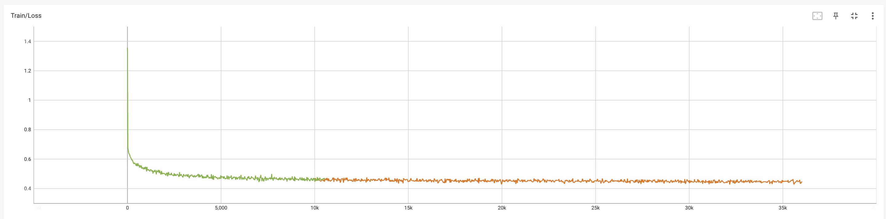

**Train/Accuracy** — rises rapidly to ~0.75 within the first 2k steps, plateaus around **0.78**.

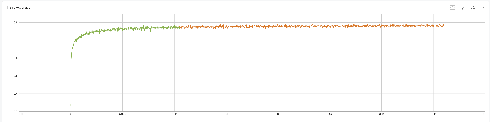

**Val/Accuracy** — more oscillatory than train (evaluated on held-out shard), converges to **~0.75**.  The ~3-point train/val gap indicates mild overfitting but no collapse.

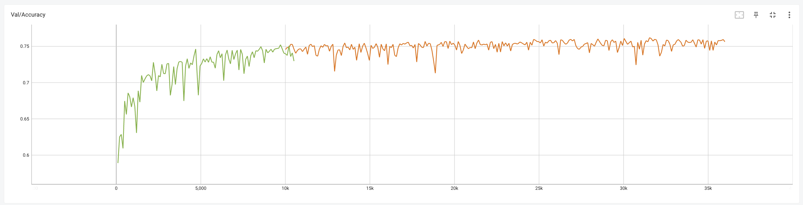

##### Sample predictions at step 35,992

The panels below show, for a single validation tile, the 1536-dimensional bipolar feature vector.
Red = +1, Blue = -1.

**Target** (Gigapath-derived ground truth):

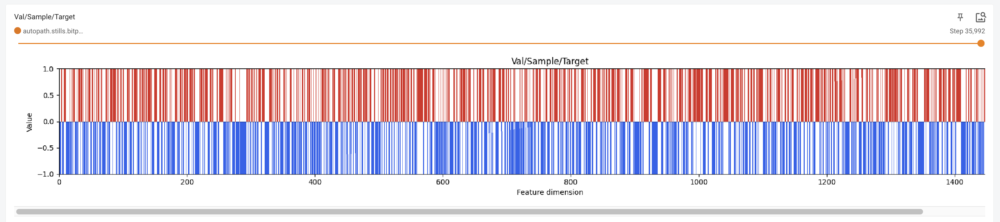

**Output** (BitPathConv prediction):

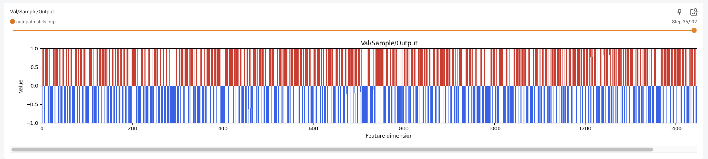

The coarse red/blue structure is faithfully reproduced.  The network has learned the dominant
sign pattern of the Gigapath feature space from raw pixels alone.

**Diff** (output - target, shown at step 10,512 for clarity):

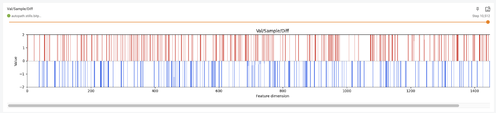

Non-zero spikes (|diff| = 2, i.e. a sign flip) are visible but sparse.  By step 10k the error
pattern is already substantially sparser than at initialization, consistent with the ~0.75 per-dimension accuracy.

##### Summary

| Metric | Value |
|---|---|
| Steps trained | ~36k |
| Train loss (final) | ~0.43 |
| Train accuracy (final) | ~0.78 |
| Val accuracy (final) | ~0.75 |
| Train/val gap | ~3 pp |

A per-dimension accuracy of 0.75 means the ternary network correctly predicts the sign of **3 out of every 4 Gigapath feature dimensions** from a raw tile — with no access to the Gigapath backbone at inference time.  This establishes a viable distillation baseline; further gains are expected from longer training, larger models, or data augmentation.

#### BitConv Feature Probe vs Gigapath

`bitconv_deep_feature_affine_logistic_probe('BITCONV_DEEP_CPTAC_602020_TEST', still=bitpath_conv_still(..., cfg_max_steps=10000), cfg_shard_size=64)`

This probe fits an affine logistic classifier on top of the **BitPathConv-extracted features** (i.e. the 1536-dim bipolar feature vector predicted by the ternary network from raw tiles) and evaluates on the held-out test set.  It measures how much cancer-type discriminative information survives the pixel → ternary-conv → bipolar-feature pipeline.

> **Note on comparability**: The Gigapath probes above (n=444) evaluated on the 20% test fold of `GIGAPATH_DEEP_CPTAC_602020_TRAIN`.  The BitConv probe below (n=148) evaluates on the separate `BITCONV_DEEP_CPTAC_602020_TEST` set.  The two evaluation sets are not identical, so differences in class balance and support affect the comparison.

##### Summary comparison

| Feature source | Accuracy | Macro F1 | Weighted F1 | Mean Asphericity | n |
|---|---|---|---|---|---|
| Gigapath (no norm) | 0.97 | 0.93 | 0.97 | 0.020 | 444 |
| Gigapath (corner-l1) | 0.97 | **0.96** | 0.97 | 0.015 | 444 |
| **BitPathConv (10k steps)** | **0.92** | **0.81** | **0.91** | **0.057** | **148** |
| Bipolar (no norm) | 0.97 | 0.96 | 0.97 | 0.436 | 444 |

The BitConv probe achieves **0.92 accuracy** with features extracted entirely from raw tiles by a ternary network — 5pp below Gigapath on a comparable but separate test set.  The asphericity (0.057) falls between Gigapath real (0.020) and bipolar (0.436), reflecting that the BitConv feature distribution is more offset from the origin than real Gigapath features but far less so than discrete bipolar ones.

##### Per-class results (BitConv, accuracy 0.92)

| Cancer type | Precision | Recall | F1 | n |
|---|---|---|---|---|
| BRCA | 0.60 | 1.00 | 0.75 | 3 |
| CCRCC | 1.00 | 0.88 | 0.94 | 26 |
| COAD | 0.80 | 1.00 | 0.89 | 8 |
| GBM | 0.88 | 1.00 | 0.93 | 14 |
| HNSCC | 0.83 | 0.83 | 0.83 | 6 |
| LSCC | 0.88 | 0.91 | 0.89 | 23 |
| LUAD | 1.00 | 0.90 | 0.95 | 31 |
| **OV** | **0.00** | **0.00** | **0.00** | 2 |
| PDA | 0.93 | 1.00 | 0.97 | 14 |
| UCEC | 0.95 | 0.95 | 0.95 | 21 |

Asphericity: BRCA=0.064, CCRCC=0.090, COAD=0.090, GBM=0.032, HNSCC=0.068, LSCC=0.058, LUAD=0.059, OV=0.091, PDA=0.003, UCEC=0.012.

OV collapses (n=2; too few support slides).  BRCA (n=3) achieves perfect recall but imprecise.  All well-supported classes (CCRCC, LUAD, PDA, UCEC) exceed F1=0.90.

---

## Next Steps

### 1  CPU-only fast feature extraction and classification

The end goal of the distillation pipeline is inference without a GPU or the Gigapath ViT backbone.  Because BitPathConvNet uses only ternary weights, all multiply-accumulate operations reduce to additions and subtractions, making the network suitable for CPU-only deployment.  Downstream classification then operates on the predicted bipolar feature vector, which fits entirely in cache and supports fast Hamming-distance lookups.

### 2  Data/model "tomography" via binary network connectivity

The ternary weight matrices of BitPathConvNet are unusually amenable to intrinsic analysis because their values are exactly in {-1, 0, +1} — small enough to reason about combinatorially.

**Estimates of latent dimension.**  The effective rank of each layer's weight matrix (fraction of non-zero singular values, or participation ratio of the weight spectrum) gives a lower bound on the information-carrying capacity of that layer.  Comparing effective ranks across layers reveals where the network bottlenecks information.

**Entropy production between layers.**  For a fixed input distribution, each layer maps one random variable (activations) to another.  The change in activation entropy across layers measures how much the network compresses or expands the representation — analogous to entropy production in a thermodynamic system.

**Mutual information and hierarchy between layers.**  Pairs of layers can be compared by their shared mutual information (how much knowing one layer's activations tells you about another's).  Layers with high mutual information are functionally redundant; low mutual information indicates that the later layer has synthesised genuinely new information.  This is closely related to notions of causal hierarchy and synergy.

> **Challenge**: reading these quantities from the weight matrices alone is insufficient because non-linear activations (ReLU, RMSNorm) gate information flow.  The connectivity plot below shows the *structural* (weight-level) connectivity — each panel is one convolutional layer of BitPathConvNet, with output channels on top and input channels on bottom.  Red = +1, blue = -1, white = 0 (absent connection).  The progressive specialisation from early uniform connectivity to late structured/sparse patterns is visible, but the functional information flow requires activation-level statistics in addition.

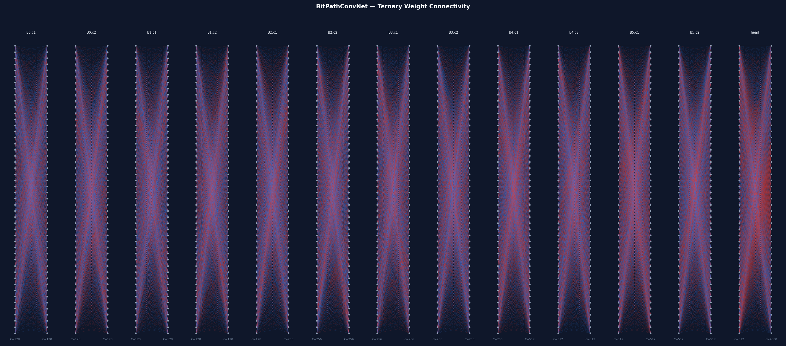

### 3  "Nearby" image lookup and cancer-space navigation

Because the predicted bipolar feature vector lives in {-1, +1}^1536, similarity between tiles is naturally measured by **Hamming distance** — computable with a single XOR + popcount operation per pair, with no floating-point arithmetic.  This enables:

- **Fast nearest-neighbour lookup**: given a query tile, retrieve the K most similar tiles from a reference library in microseconds on CPU, using bit-packed vectors and SIMD popcount.
- **Cancer-space navigation**: the binary feature space partitions slides into a discrete graph; edges connect tiles whose features differ by at most d bits.  Traversing this graph reveals morphological transitions between cancer types and grades.
- **Anomaly detection**: tiles whose nearest neighbours in feature space all belong to a different cancer type are candidates for ambiguous or mixed pathology.
