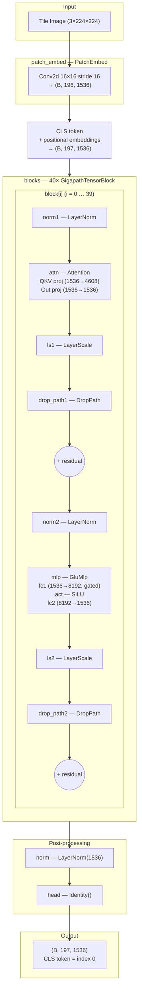

# GigaPath Tile Backbone Architecture

> **Reference:** Xu, H., Usuyama, N., Bagga, J. et al. *A whole-slide foundation model for digital pathology from real-world data.* Nature 630, 181–188 (2024). [doi:10.1038/s41586-024-07441-w](https://doi.org/10.1038/s41586-024-07441-w)

## Model Overview

The GigaPath tile encoder is a **DINOv2 Vision Transformer (ViT-Giant)** with SiLU activations and gated MLPs, pre-trained on 1.3 billion pathology tiles from over 170,000 whole-slide images.

| Parameter       | Value         |
|-----------------|---------------|
| Embedding dim   | 1536          |
| Num heads       | 24            |
| Depth (blocks)  | 40 (indexed 0–39) |
| Patch size      | 16 × 16       |
| Image size      | 224 × 224     |
| MLP hidden dim  | 8192 (2 × 4096, GluMlp) |
| Activation      | SiLU          |
| LayerScale      | ✓ (init=1.0)  |
| DropPath         | linearly increasing |
| Registers       | 0             |

## Architecture Diagram



## Capture Points

The `GigapathDeepBackboneEvaluator` can hook into any of these locations:

### `capture_blocks` — Transformer block outputs (list of int)

Hooks the **output** of the specified `GigapathTensorBlock` (after the second residual).

| Example               | Description                         |
|------------------------|-------------------------------------|
| `capture_blocks=[0]`  | First block output                  |
| `capture_blocks=[-1]` | Last block output (block 39)        |
| `capture_blocks=list(range(40))` | All 40 block outputs |

Output shape: `(B, 197, 1536)` or `(B, 1536)` with `cls_token_only=True`.

### `capture_layers` — Named model layers (list of str)

Hooks the **output** of top-level model attributes.

| Layer          | Description                                         | Output shape        |
|----------------|-----------------------------------------------------|---------------------|
| `"patch_embed"` | Patch embedding before CLS token prepend            | `(B, 196, 1536)`   |
| `"norm"`       | Final LayerNorm after all blocks                     | `(B, 197, 1536)`   |
| `"head"`       | Head projection (Identity in pre-trained model)      | `(B, 197, 1536)`   |
| `"backbone"`   | Full model output                                    | `(B, 197, 1536)`   |

### Block sub-layers

Available sub-layers within each block (for advanced probing):

```
norm1, attn, attn.qkv, attn.proj, ls1,
norm2, mlp, mlp.fc1, mlp.act, mlp.fc2, ls2
```

## Pipeline Examples

```bash
# Single bag — all 40 blocks, CLS token only
dbx.print "autopath.gigadeep.pipelines.gigapath_deep_feature_bag( \
    'GIGAPATH_DEEP_CPTAC_SAMPLE', \
    cls_token_only=True).build()"

# Clip — final block only (fast)
dbx.print "autopath.gigadeep.pipelines.gigapath_deep_feature_clip( \
    'GIGAPATH_DEEP_CPTAC_404020_TRAIN', \
    capture_blocks=[-1], \
    cls_token_only=True, \
    device_batch_size=1024).build()"

# Clip — final LayerNorm output
dbx.print "autopath.gigadeep.pipelines.gigapath_deep_feature_clip( \
    'GIGAPATH_DEEP_CPTAC_404020_TRAIN', \
    capture_layers=['norm'], \
    cls_token_only=True, \
    device_batch_size=1024).build()"
```
