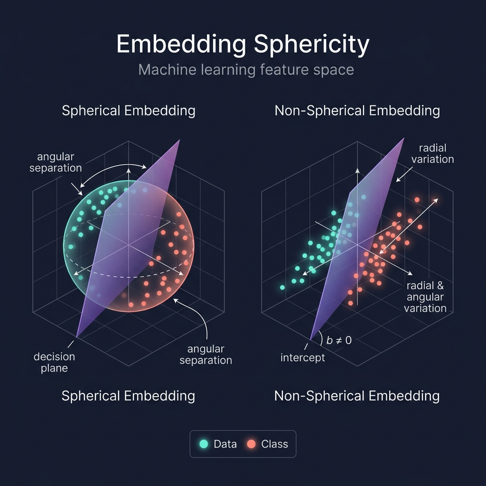
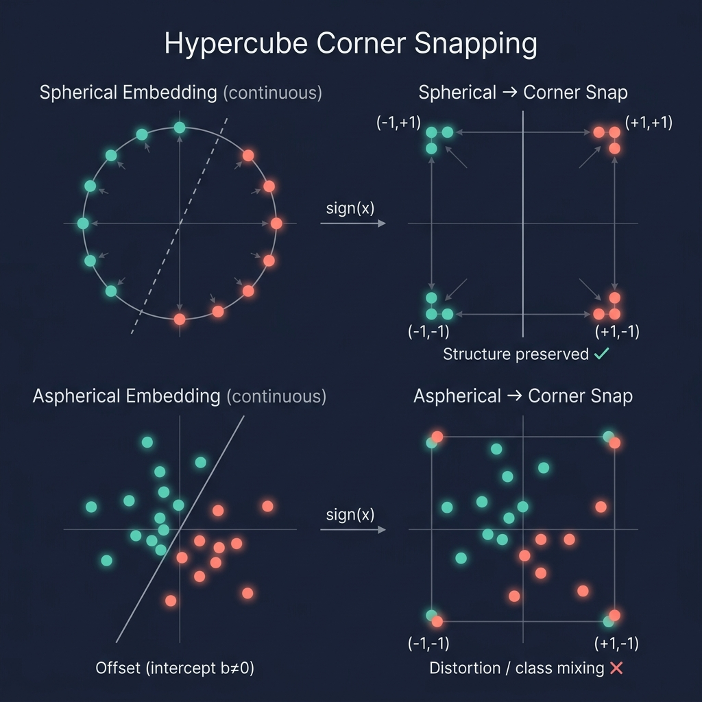
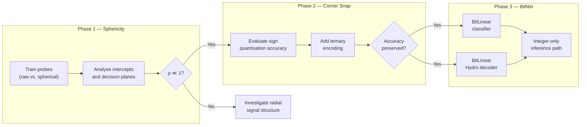

# DEEPQ — Deep Embedding Quality

> Investigating the geometric structure of CPTAC latent embeddings
> produced by the GigaPath Tile Encoder (DINOv2 ViT-Giant, $d = 1536$).

## Executive Summary

1. **Sphericity / Angularity & Decision Plane Structure**

   Determine whether the GigaPath embedding is functionally spherical
   (angular information dominates, radial scale is irrelevant).
   Test via rescaling invariance of linear probes and by measuring
   whether decision hyperplanes pass through the origin
   ($\|b\| \ll \|W\| \cdot \bar{r}$).

2. **Corner Snapping & Decision Plane Structure**

   Evaluate lossless discretisation of features to hypercube vertices
   $\{-1,+1\}^d$ (binary) or $\{-1,0,+1\}^d$ (ternary).
   Measure classification accuracy retention and verify that the
   decision planes of corner-snapped probes remain structurally
   equivalent to those of the continuous embedding.

3. **BitNet Classifiers & Pixel Decoders**

   Assess whether ternary-weight (BitNet 1.58b) layers can replace
   float32 linear layers in downstream classifiers and in the
   Hydro pixel decoder, enabling an end-to-end integer-only
   inference path from quantised features to predictions / reconstructions.

4. **Finetuning of DinoV2 backbone for KoLeo intervention**

**Note**
   We are now re-encoding the CPTAC training dataset and storing as MosaicML/Streaming (MDS) datasets for better GPU utilization.

---

## Motivation

The GigaPath tile encoder maps $224 \times 224$ pathology tiles into
$\mathbb{R}^{1536}$.  Before investing in complex downstream architectures
we need to understand *what the embedding actually looks like*:

- Is the representation essentially **spherical** (angular), or does radial
  variation carry signal?
- Can the representation be **losslessly discretised** to binary features
  (corners of the unit hypercube)?
- If discretisation is viable, does it enable **1-bit inference** (BitNet)
  for both classifiers and pixel decoders?

The answers determine the minimal fidelity required for storage,
transmission, and computation on these features.

> [!NOTE]
> We are **NOW** re-encoding the CPTAC training dataset through GigaPath
> as part of this investigation.  The tile-level embeddings have already
> been materialized and stored as MosaicML/Streaming (MDS) datasets via
> `DeepFeatureClip`.  All experiments below operate on these
> pre-materialized features — the spherical and corner views
> (`SphericalDeepFeatureClip`, `CornerDeepFeatureClip`) are pure runtime
> transformations that read from the same MDS shards.

---

## 1 — Sphericity of the Embedding

**Goal.**  Determine whether the GigaPath output lives on (or very near)
a hypersphere, and what consequences this has for linear probing.



### 1.1  Rescaling Invariance of Linear Probing

A linear probe $\hat y = \mathrm{sign}(\mathbf{w}^\top \mathbf{x} + b)$
is invariant to a global rescaling $\mathbf{x} \mapsto \alpha \mathbf{x}$
only when the intercept $b$ is negligible relative to the inner product
$\mathbf{w}^\top \mathbf{x}$.  

**Experiment.**

| Step | Description | Infrastructure |
|------|-------------|----------------|
| 1 | Train `LinearDeepFeatureClipProbe` on raw features with `fit_intercept=True` | `deep.probes` |
| 2 | Train on `SphericalDeepFeatureClip` (L2-normalised) with `fit_intercept=True` | `deep.features` |
| 3 | Compare accuracy, `coef_`, and `intercept_` across both | persisted topics |
| 4 | Repeat for multiple layers (early / middle / late blocks) | per-layer loop |

**Observable.**  If accuracy is unchanged and $\|\mathbf{b}\| \approx 0$
in both cases, the classifier is effectively scale-invariant and the
embedding is *functionally spherical* for linear probing.

### 1.2  Structure of the Decision Hyperplanes

For a $K$-class logistic regression, the decision boundary between
classes $i$ and $j$ is the hyperplane

$$(\mathbf{w}_i - \mathbf{w}_j)^\top \mathbf{x} + (b_i - b_j) = 0.$$

**Questions.**

1. Do these planes pass (approximately) through the origin?
   - Equivalently: are the intercept differences $|b_i - b_j|$ small
     compared to $\|(\mathbf{w}_i - \mathbf{w}_j)\| \cdot \|\mathbf{x}\|$?
2. Are the normal vectors $\mathbf{w}_i - \mathbf{w}_j$ close to the
   unit sphere themselves, or do they span a low-rank subspace?

**Experiment.**

| Step | Description | Infrastructure |
|------|-------------|----------------|
| 1 | Extract `coef_` and `intercept_` from `LinearDeepFeatureClipProbe` | persisted `coef` / `intercept` topics |
| 2 | Compute all pairwise normal vectors $\mathbf{w}_i - \mathbf{w}_j$ | offline analysis |
| 3 | Measure $\|b_i - b_j\| / (\|\mathbf{w}_i - \mathbf{w}_j\| \cdot \bar r)$ where $\bar r$ is the mean feature norm | `StatsDeepFeatureClipProbe` |
| 4 | Compute the rank / singular spectrum of the weight matrix $W \in \mathbb{R}^{K \times d}$ | SVD of `coef_` |

### 1.3  Are the Intercepts Almost Zero?

A direct diagnostic: for every probe, report the ratio

$$\rho = \frac{\|\mathbf{b}\|}{\|\mathbf{W}\|_F \cdot \bar r}$$

where $\bar r$ is the mean L2 norm of the bag-level features.  If
$\rho \ll 1$, the decision boundaries are essentially origin-centred
and rescaling is harmless.

**Already instrumented:**  `LinearDeepFeatureClipProbe.__build__` logs
`intercept norm` at build time.  We extend this to log $\rho$ as well.

---

## 2 — Corner Snapping

**Goal.**  Evaluate the information loss when mapping continuous features
to the vertices of the unit hypercube $\{-1, +1\}^d$.



### 2.1  Sign Quantisation (Per-Tile)

The simplest discretisation: $\mathbf{x} \mapsto \mathrm{sign}(\mathbf{x})$.

This is already implemented as `CornerDeepFeatureBag.layer_features()`:

```python
def layer_features(self, layer: str):
    t = self.cfg.deep_feature_bag.layer_features(layer)
    return torch.sign(t)
```

**Experiment.**

| Step | Description | Infrastructure |
|------|-------------|----------------|
| 1 | Build `CornerDeepFeatureClip` over CPTAC | `deep.pipelines.gigapath_corner_deep_feature_clip` |
| 2 | Train `LinearDeepFeatureClipProbe` on the corner clip | `deep.probes` |
| 3 | Compare accuracy to the raw-feature and spherical probes | — |
| 4 | Count distinct corners via `corner_ids()` and compare to tile count | `CornerDeepFeatureBag.corner_ids` |

**Hypothesis.**  If the embedding is approximately spherical and the
decision planes pass through the origin, sign quantisation should
preserve most of the linear-probing signal.

### 2.2  Uncertain Features → Zero (Bag-Informed Snapping)

Pure $\mathrm{sign}(\cdot)$ forces every dimension to $\pm 1$.
Dimensions where the tile feature is close to zero carry little
directional information and may introduce noise.

**Ternary encoding.**  For each dimension $j$, define

$$q_j = \begin{cases}
  +1 & \text{if } x_j > \tau_j \\
  -1 & \text{if } x_j < -\tau_j \\
   0 & \text{otherwise}
\end{cases}$$

where $\tau_j$ is estimated from the **bag-level mean** (or median) of
$|x_j|$.  This extends the existing `BipolarFeatureBagProbe` trit
($\{-1, 0, +1\}$) logic to the deep feature hierarchy.

**Experiment.**

| Step | Description | Infrastructure |
|------|-------------|----------------|
| 1 | Compute per-dimension thresholds $\tau_j$ from bag means | `StatsDeepFeatureClipProbe.tile_feature_median` |
| 2 | Apply ternary encoding per tile | new transform (extend `CornerDeepFeatureBag`) |
| 3 | Train linear probe on ternary features | `deep.probes` |
| 4 | Compare accuracy and sparsity (fraction of zeros) to binary corner snap | — |

### 2.3  Storage Implications

| Encoding | Bits per tile | Compression vs. float32 |
|----------|--------------|------------------------|
| float32  | $1536 \times 32 = 49152$ | 1× |
| float16  | $1536 \times 16 = 24576$ | 2× |
| binary ($\pm 1$) | $1536 \times 1 = 1536$ | 32× |
| ternary ($\{-1,0,+1\}$) | $1536 \times \log_2 3 \approx 2434$ | ~20× |

---

## 3 — BitNet Viability

**Goal.**  Determine whether 1-bit (ternary) weights are sufficient for
downstream models that consume the GigaPath embedding.

### 3.1  Background

BitNet 1.58b ([Ma et al., 2024](https://arxiv.org/abs/2402.17764))
replaces standard `nn.Linear` layers with ternary-weight
($\{-1, 0, +1\}$) linear layers, achieving competitive accuracy at
dramatically reduced compute and memory.

If the *input* features are already corner-snapped (binary / ternary),
the forward pass of a BitNet linear layer reduces to **integer addition
only** — no floating-point multiply-accumulate required.

### 3.2  Downstream Classifiers

Replace the logistic regression head with a small MLP whose linear
layers use ternary weights (BitLinear).

**Experiment.**

| Step | Description |
|------|-------------|
| 1 | Implement `BitLinear` layer (ternary weight quantisation + feature scaling) |
| 2 | Train a 2-layer BitNet MLP on bag-level mean features |
| 3 | Compare to float32 logistic regression and float32 MLP |
| 4 | Measure accuracy, parameter count (effective bits), and inference FLOPs |

**Key question:**  Does the combination of corner-snapped inputs +
ternary weights preserve classification accuracy?  If so, the entire
inference path (features → prediction) is integer-only.

### 3.3  Pixel Decoding (Hydro / DCAE)

The Hydro decoder reconstructs tiles from latent embeddings.  If the
latent can be corner-snapped without reconstruction loss, the decoder
itself may tolerate ternary weights.

**Experiment.**

| Step | Description | Infrastructure |
|------|-------------|----------------|
| 1 | Decode corner-snapped embeddings with the pretrained float32 Hydro decoder | `autopath.stills.hydro` |
| 2 | Measure reconstruction quality (MSE, LPIPS) vs. float32 input | — |
| 3 | If acceptable: retrain Hydro with BitLinear layers and corner-snapped input | — |
| 4 | Compare quality and throughput | — |

**Hypothesis.**  Pixel decoding is more sensitive to quantisation than
classification because it must recover spatial detail.  We expect a
quality gap that narrows with ternary-aware fine-tuning.

---

## Existing Infrastructure

| Component | Location | Role |
|-----------|----------|------|
| `LinearDeepFeatureClipProbe` | `autopath/gigapan/probes.py` | Per-layer logistic regression with persisted weights |
| `StatsDeepFeatureClipProbe` | `autopath/gigapan/probes.py` | Tile/bag-level norms, medians, distinct counts |
| `SphericalDeepFeatureBag/Clip` | `autopath/gigapan/features.py` | Runtime L2-normalisation |
| `CornerDeepFeatureBag/Clip` | `autopath/gigapan/features.py` | Runtime sign quantisation, `corner_ids()` |
| `SpectralProbe` | `autopath/gigapan/probes.py` | Jacobian SVD for layer dynamics |
| `SphericalFeatureBag/Clip` | `autopath/features.py` | Legacy L2-normalisation (single-layer) |
| `BipolarFeatureBag/Clip` | `autopath/features.py` | Legacy median-based trit encoding |
| `AffineLogisticFeatureBagProbe` | `autopath/probes.py` | Single-layer probe with `coef_` / `intercept_` persistence |
| Pipeline entry points | `autopath/gigapan/pipelines.py` | `gigapath_spherical_deep_feature_clip`, `gigapath_corner_deep_feature_clip` |

---

## Roadmap


